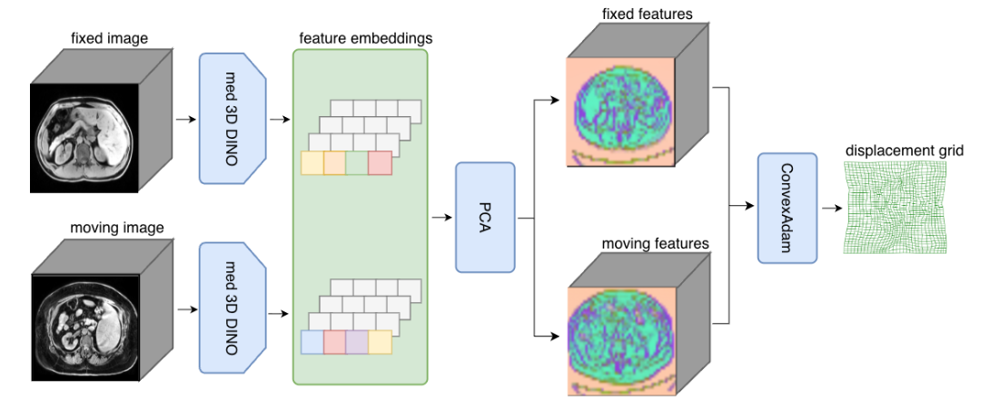
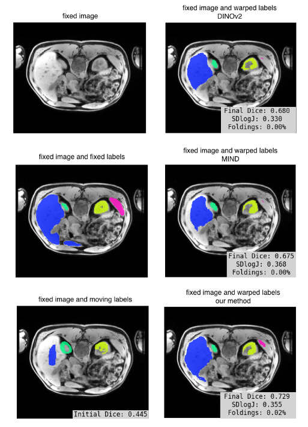

# Effective Feature Learning for 3D Medical Registration via Domain-Specialized DINO Pretraining

This project explores how to improve **3D medical image registration** - 
the process of aligning two scans so that anatomical structures match up.
Accurate registration is important for many clinical tasks, such as comparing patient scans over time,
combining different imaging modalities, or guiding procedures.  

Feature-based registration methods use **semantic features** (representations of image structure)
instead of raw intensities. Recently, models like **DINOv2**, trained on natural images,
have shown promise - but they require high-resolution 2D slices and large GPU memory,
making them impractical for 3D medical workflows.

### What this work does
This project trains a **DINO-style self-supervised model directly on 3D medical images**, instead of using 2D models trained on natural photos. The goal is to learn features that:
- Capture fine anatomical details,
- Are robust across patients and modalities,
- Work out-of-the-box for registration (zero-shot),
- Require low computational resources.

### Key ideas
- The model is based on a 3D-adapted Vision Transformer (PRIMUS).
- It is trained with DINO-style objectives that help the model learn meaningful 3D representations without labels.
- Smaller patch sizes (e.g., \(4 \times 4 \times 4\)) are essential—they preserve local anatomical structure, improving registration accuracy.
- The learned features are used together with **ConvexAdam**, a strong registration optimizer.

### Main results
Across challenging abdominal registration tasks (MRI and CT), the proposed 3D medical DINO model:
- Outperforms **DINOv2** despite using far fewer resources,
- Achieves higher accuracy than classic hand-crafted features like **MIND**,
- Reduces VRAM requirements drastically (≈5GB vs ≈35GB for DINOv2),
- Operates with a single 3D forward pass, making it efficient and practical.

### Why this matters
The results show that **task-agnostic but domain-specific pretraining** - 
learning from unlabeled medical 3D volumes - can produce features well suited for robust, accurate registration.
This has strong implications for medical imaging workflows where reliability and efficiency are crucial.
